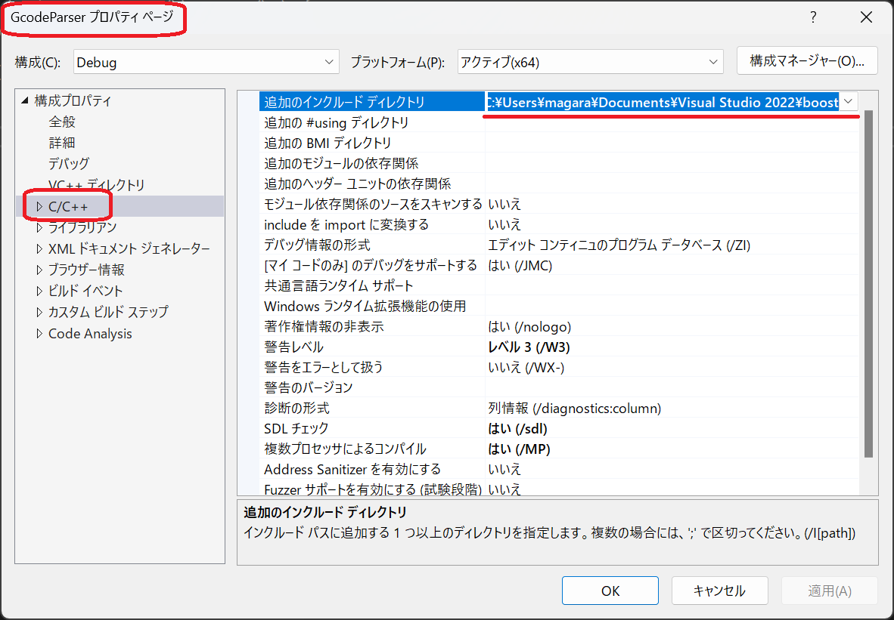
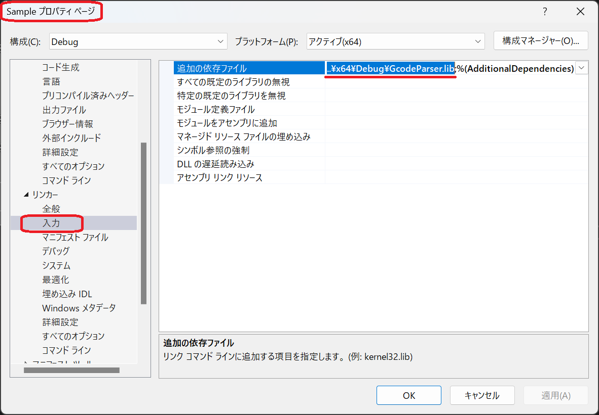
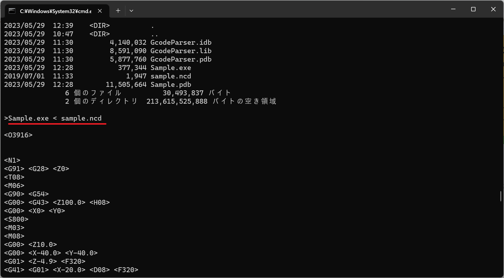

# GcodeParser
This library is a C++ class library for extracting words from G code block.

## Requirement
* Boost C++ 1.82.0 or later <https://www.boost.org/> (Simply expand it.)

When building GcodeParser, specify the path to boost.

When building Sample, check the location of the GcodePaser library.
Sample is not using boost library.
Link GcodeParser.lib.

## Usage
Visual Studio 2022 Solution  

## Author
Kenichi Magara / NIT(KOSEN) Maizuru College

## License
"GcodeParser" is under [BSD license (3-clause BSD License)]

## Image

